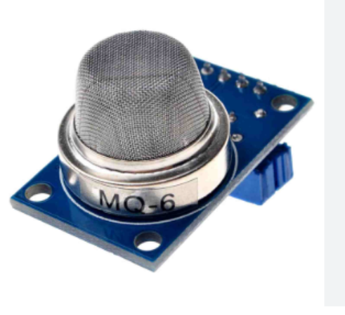
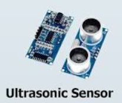
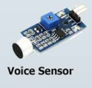
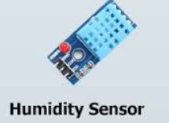
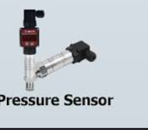

### Lab 4 — Different Types of IoT Sensors

## Title
**Different Types of IoT Sensors**

## Objectives
- Understand the concept and importance of IoT sensors
- Identify and classify common IoT sensors
- Learn basic functions and working principles of each sensor type
- See typical applications and wiring/use-cases for sensors

## Introduction
The Internet of Things (IoT) is a network of interconnected devices that sense and interact with the physical world. Sensors are the primary components that collect environmental data and feed it to microcontrollers and cloud systems for processing and action.

## Background Theory

### What is a sensor?
A sensor converts a physical phenomenon (temperature, humidity, pressure, motion, gas concentration, light, etc.) into an electrical signal that can be measured and processed.

### Basic data flow
Physical environment → Sensor → Microcontroller → Network → Cloud/Application

## Classification of IoT sensors

### Based on measured parameter
- **Temperature:** LM35, DHT11
- **Humidity:** DHT11, DHT22
- **Pressure:** BMP180, BMP280
- **Light:** LDR, Photodiode
- **Motion:** PIR, Ultrasonic (HC-SR04)
- **Gas:** MQ-series (MQ-2, MQ-6, MQ-135)

### Based on function
- **Environmental sensors:** temperature, humidity, air-quality
- **Motion/position sensors:** PIR, ultrasonic, accelerometer, GPS
- **Optical sensors:** light, IR

## Types of IoT Sensors (summary)
| Sensor Type | Example | Typical Use |
|---|---:|---|
| Temperature | LM35, DHT11 | Weather stations, HVAC |
| Humidity | DHT11 | Agriculture, greenhouse control |
| Light | LDR | Automatic lighting, displays |
| Motion | PIR, HC-SR04 | Security, obstacle detection |
| Gas | MQ-2, MQ-6 | Air quality, leak detection |
| Pressure | BMP180 | Weather, industrial monitoring |

## Working principle
Sensors change physical measurements to electrical signals (voltage, resistance, frequency). Microcontrollers read these signals (ADC/digital inputs), optionally filter/calibrate, and send data to local or cloud applications.

## Importance and applications
- Real-time environmental monitoring
- Automation (smart homes, agriculture)
- Industry monitoring and predictive maintenance
- Smart city sensing (traffic, air quality)

## Procedure (theoretical study)
1. Read datasheets and tutorials for each sensor type
2. Identify wiring and interface (analog, digital, I2C, SPI)
3. Sketch small circuit and read values using a microcontroller (e.g., Arduino, ESP)
4. Record example outputs and analyze

## Images of sensors
Below are the example sensor images used in this lab. Click to view full size on GitHub.

### MQ-6 gas sensor

### Ultrasonic sensor (HC-SR04)

### Voice sensor

### Humidity sensor (DHT11 style)

### Pressure sensor

Ultrasonic Sensors

## Output
- Knowledge of sensor classifications and applications
- Ability to wire and read basic sensor outputs
- Understanding of how to integrate sensors into IoT workflows

## Conclusion
Sensors are fundamental to IoT systems — they collect data that drives automation, monitoring, and analytics. Choosing the right sensor depends on accuracy, interface, cost, and environmental suitability.

