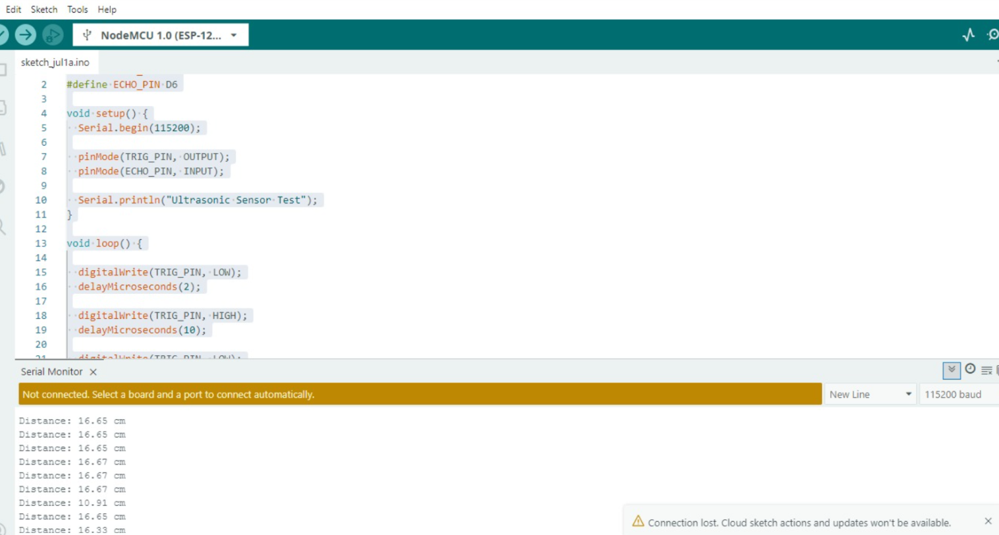
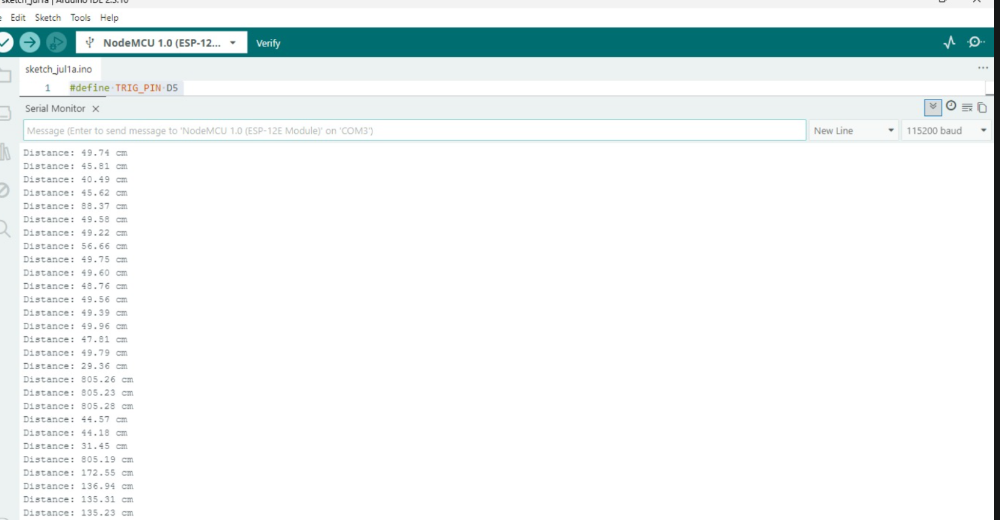
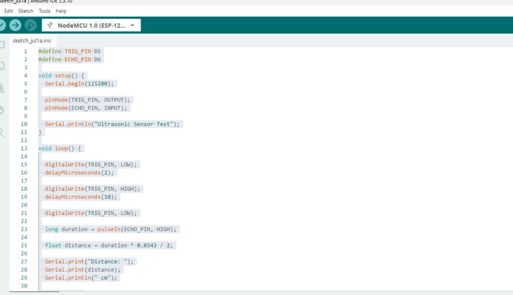

## **Lab 5**

### **Title:** Integrating ESP32 Sensor Data with Cloud-Based REST API and Dashboard Visualization

### **Objectives**

1. Interface the DHT11 or DHT22 temperature and humidity sensor with the ESP32 or ESP8266.
2. Read and display sensor data on the Serial Monitor.
3. Review the REST API developed and deployed on the AWS EC2 instance in Lab 2.
4. Transmit sensor data from the ESP32 to the cloud using the REST API over the EC2 instance's public IPv4 address.
5. Store the uploaded sensor data in the cloud database.
6. Retrieve the stored sensor data through the REST API.
7. Visualize real-time and historical sensor data using the dashboard developed in Lab 3.
8. Understand the complete data flow from an IoT device to cloud storage and visualization.

---

### **Background Theory**

- ESP32 Microcontroller overview and capabilities
- DHT22 (and DHT11) Temperature and Humidity Sensor principles
- Sensor Data Acquisition and timing constraints
- Serial Communication for debugging and verification
- REST API Communication and JSON payloads
- HTTP POST and GET Methods for data upload and retrieval
- Cloud Data Storage (database used by the Lab 2 API)
- API Integration with Embedded Systems (using Wi-Fi and HTTP client)
- IoT Data Flow: device → API → database → dashboard

---

### **Components & Prerequisites**

- ESP32 development board (or ESP8266)
- DHT22 (recommended) or DHT11 sensor
- Jumper wires and breadboard
- USB cable for programming and serial monitor
- Arduino IDE (or PlatformIO) with ESP32 board support installed
- Libraries: `DHT sensor library` (Adafruit) and `Adafruit Unified Sensor` plus built-in `WiFi.h` (ESP32)
- Public IPv4 address of your AWS EC2 instance running the Lab 2 REST API
- The REST API endpoint (for example `http://<EC2_IP>:5000/sensor` — adjust port/path to your Lab 2 API)
- Access to the dashboard from Lab 3 (URL or local preview)

---

### **Wiring (DHT22 to ESP32)**

- DHT22 VCC -> 3.3V on ESP32
- DHT22 GND -> GND on ESP32
- DHT22 DATA -> GPIO 4 (or any other digital pin) on ESP32 (use a 10K pull-up if required)
- If using DHT11, wiring is the same but expect lower accuracy and slower response.

Adjust the `DATA` pin in the sample sketch if you use a different GPIO.

---

### **Procedure**

1. Assemble the circuit as described in the wiring section.
2. Install the required Arduino libraries: `DHT sensor library` and `Adafruit Unified Sensor`.
3. Open the Serial Monitor in the Arduino IDE (baud rate 115200) to observe sensor output.
4. Load the example sketch below, replace the `SSID`, `PASSWORD`, and `API_URL` placeholders with your network credentials and your EC2 REST API endpoint.
5. Upload the sketch to the ESP32 and open the Serial Monitor.
6. Verify that temperature and humidity readings appear regularly in the Serial Monitor.

	
	*Serial Monitor showing periodic temperature & humidity readings.*
7. Confirm that the ESP32 is able to send HTTP POST requests to the EC2 API and that the API returns a success response (HTTP 200/201 or a JSON success message).

	
	*Example API response observed after POST from the ESP32.*
8. Check the cloud database (or use the Lab 2 API GET endpoints) to verify the data is stored.
9. Open the Lab 3 dashboard and verify that new data points appear on the real-time visualization and historical charts.

	
	*Dashboard displaying the uploaded sensor data (real-time and historical view).* 
10. Record your observations, screenshots of Serial Monitor, API responses, and dashboard graphs for the lab report.

---

### **Example ESP32 Sketch (Arduino)**

Replace `YOUR_SSID`, `YOUR_PASSWORD`, and `http://<EC2_IP>:<PORT>/sensor` with actual values.

```cpp
#include <WiFi.h>
#include <HTTPClient.h>
#include "DHT.h"

#define DHTPIN 4        // GPIO where the DHT data pin is connected
#define DHTTYPE DHT22   // DHT22 (AM2302)

const char* ssid = "YOUR_SSID";
const char* password = "YOUR_PASSWORD";
const char* apiUrl = "http://<EC2_IP>:5000/sensor"; // update with your API endpoint

DHT dht(DHTPIN, DHTTYPE);

void setup() {
	Serial.begin(115200);
	delay(1000);
	dht.begin();

	WiFi.begin(ssid, password);
	Serial.print("Connecting to WiFi");
	unsigned long start = millis();
	while (WiFi.status() != WL_CONNECTED) {
		delay(500);
		Serial.print(".");
		if (millis() - start > 20000) {
			Serial.println("\nWiFi connect timeout");
			break;
		}
	}
	if (WiFi.status() == WL_CONNECTED) {
		Serial.println("\nWiFi connected");
		Serial.println(WiFi.localIP());
	}
}

void loop() {
	float humidity = dht.readHumidity();
	float temperature = dht.readTemperature(); // Celsius

	if (isnan(humidity) || isnan(temperature)) {
		Serial.println("Failed to read from DHT sensor!");
		delay(2000);
		return;
	}

	// Print to Serial Monitor
	Serial.print("Temperature: "); Serial.print(temperature); Serial.print(" °C");
	Serial.print("  |  Humidity: "); Serial.print(humidity); Serial.println(" %");

	// Prepare JSON payload
	String payload = "{";
	payload += "\"device_id\":\"esp32-1\",";
	payload += "\"temperature\":" + String(temperature, 2) + ",";
	payload += "\"humidity\":" + String(humidity, 2) + ",";
	payload += "\"timestamp\":\"" + String((unsigned long)time(nullptr)) + "\"";
	payload += "}";

	if (WiFi.status() == WL_CONNECTED) {
		HTTPClient http;
		http.begin(apiUrl);
		http.addHeader("Content-Type", "application/json");
		int httpResponseCode = http.POST(payload);
		if (httpResponseCode > 0) {
			String response = http.getString();
			Serial.print("POST response code: ");
			Serial.println(httpResponseCode);
			Serial.print("Response: ");
			Serial.println(response);
		} else {
			Serial.print("Error on sending POST: ");
			Serial.println(httpResponseCode);
		}
		http.end();
	} else {
		Serial.println("WiFi not connected, skipping POST");
	}

	// Wait before next reading
	delay(10000); // send every 10 seconds (adjust as needed)
}
```

Notes:
- The sketch uses a simple blocking approach; for production you may want to handle retries and backoff.
- Replace the `timestamp` logic with an RTC or NTP call if you need human-readable timestamps.

---

### **Example API Payload (JSON)**

POST /sensor

```json
{
	"device_id": "esp32-1",
	"temperature": 23.45,
	"humidity": 56.12,
	"timestamp": "1650000000"
}
```

Example `curl` to test the API (from your laptop):

```bash
curl -X POST -H "Content-Type: application/json" -d '{"device_id":"test","temperature":24.0,"humidity":50.0}' http://<EC2_IP>:5000/sensor
```

---

### **Verification & Expected Output**

- Serial Monitor should show periodic lines like: `Temperature: 24.30 °C  |  Humidity: 52.10 %`
- After each POST the API should respond with a success code (200/201) and possibly a JSON confirmation.
- Using the Lab 2 API GET endpoints you should be able to retrieve recent sensor records.
- The Lab 3 dashboard should show incoming data on the real-time chart and populate historical graphs.

Capture screenshots of:
- Serial Monitor output showing sensor readings
- API response printed on Serial Monitor or via `curl`
- Dashboard graphs showing the uploaded data

---

### **Troubleshooting**

- If DHT readings are `NaN`, check wiring and sensor power (use 3.3V for ESP32).
- If Wi-Fi fails to connect, verify SSID/password and that the network allows the device to reach the internet.
- If POST requests fail with connection errors, check that the EC2 instance's security group allows inbound traffic on the API port and that the API is listening on 0.0.0.0 (not only localhost).
- If data does not appear on the dashboard, verify the Lab 2 API has successfully stored records in the database and that the dashboard queries the same DB or API.

---

### **Conclusion**

In this lab you integrated a DHT22 sensor with an ESP32 to capture temperature and humidity, transmitted the readings to a cloud-hosted REST API on AWS EC2, stored them in a cloud database, and visualized the data on the dashboard from Lab 3. This demonstrates a complete IoT pipeline for remote monitoring and historical analysis.

---

### **References**

- DHT sensor datasheet and Adafruit DHT library documentation
- Arduino core for ESP32: https://github.com/espressif/arduino-esp32
- Example REST API patterns and JSON usage

