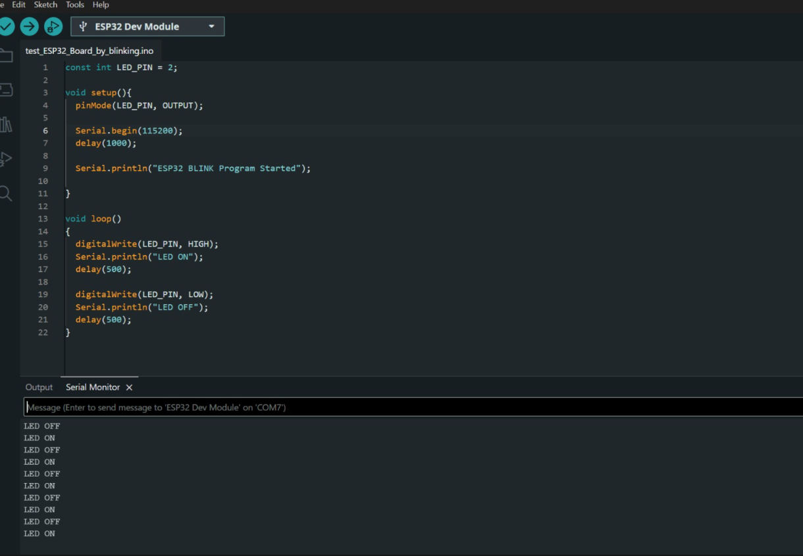
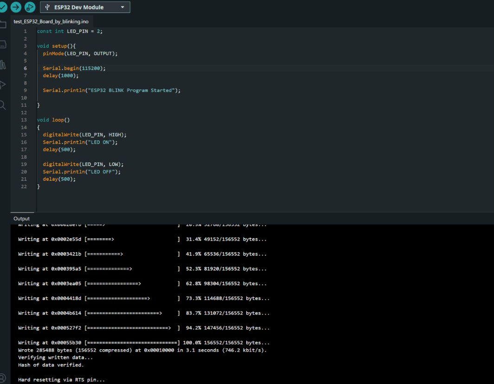
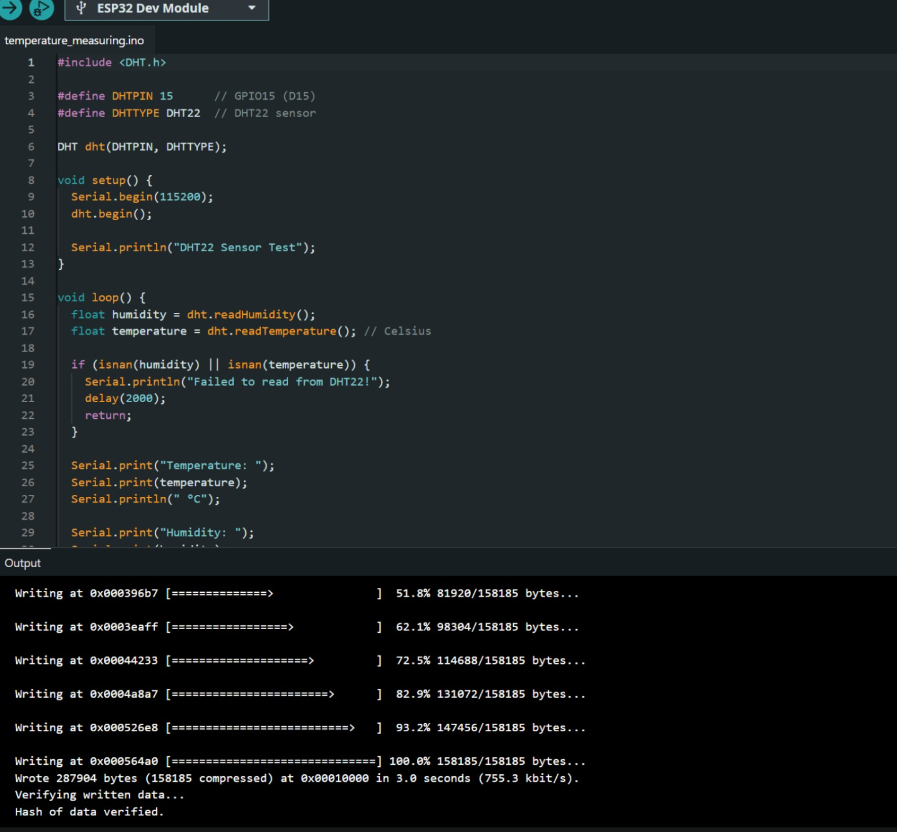
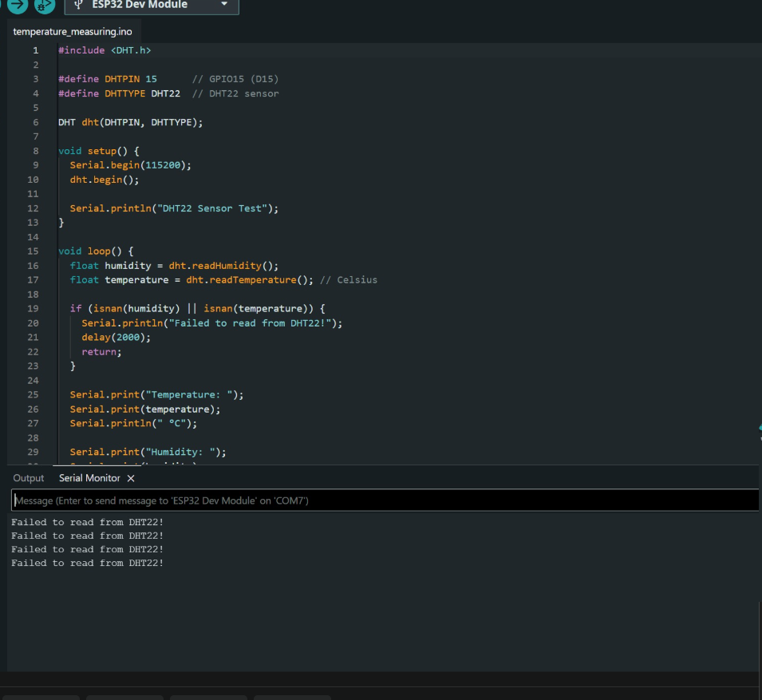

## **Lab 6**

### **Title:** Getting Started with ESP32: Blinking the Built-in LED

### **Objectives**

1. Install and configure the ESP32 board package in Arduino IDE.
2. Write and upload a basic LED blink program.
3. Understand the structure of an Arduino sketch using `setup()` and `loop()`.
4. Verify serial communication between the computer and the ESP32 using the Serial Monitor.

---

### **Requirements**

**Hardware**

- ESP32 development board
- USB cable
- Computer or laptop

**Software**

- Arduino IDE
- ESP32 board package
- USB driver, if required

---

### **Theory**

The ESP32 is a powerful microcontroller with built-in Wi-Fi and Bluetooth. It is widely used for Internet of Things (IoT) applications.

The built-in LED on most ESP32 development boards is connected to GPIO 2. By setting this pin HIGH and LOW repeatedly with a delay, the LED blinks continuously.

An Arduino program consists of two main functions:

- `setup()` runs only once after the board powers on or resets and is used for initialization.
- `loop()` runs continuously after `setup()` and contains the main program logic.

---

### **Program**

```cpp
const int LED_PIN = 2;

void setup() {
	pinMode(LED_PIN, OUTPUT);

	Serial.begin(115200);
	delay(1000);

	Serial.println("ESP32 BLINK Program Started");
}

void loop() {
	digitalWrite(LED_PIN, HIGH);
	Serial.println("LED ON");
	delay(500);

	digitalWrite(LED_PIN, LOW);
	Serial.println("LED OFF");
	delay(500);
}
```

---

### **Code Explanation**

`const int LED_PIN = 2;`

Defines GPIO 2 as the LED pin.

`pinMode(LED_PIN, OUTPUT);`

Configures GPIO 2 as an output pin.

`Serial.begin(115200);`

Starts serial communication at a baud rate of 115200 bps.

`digitalWrite(LED_PIN, HIGH);`

Turns the LED on.

`digitalWrite(LED_PIN, LOW);`

Turns the LED off.

`delay(500);`

Waits for 500 milliseconds.

---

### **Procedure**

1. Open Arduino IDE.
2. Install the ESP32 board package.
3. Connect the ESP32 board using a USB cable.
4. Select the correct board and COM port.
5. Copy the blink program into Arduino IDE.
6. Click Verify to compile the code.
7. Click Upload to flash the program.
8. Open the Serial Monitor.
9. Set the baud rate to 115200.
10. Observe the LED blinking and the serial messages.

---

### **Output**

**LED Behavior**

- LED turns ON for 500 ms.
- LED turns OFF for 500 ms.
- This process repeats continuously.

**Serial Monitor**

```text
ESP32 BLINK Program Started

LED ON
LED OFF
LED ON
LED OFF
LED ON
LED OFF
...
```

**Upload Status**

The program compiled and uploaded successfully.

The upload console showed:

```text
Writing firmware to ESP32
Verifying flash
Hash verified
Hard resetting via RTS pin
```

This confirms successful programming of the ESP32.

---

### **Screenshots**

Create an `images` folder in your repository and save the screenshots using these names:

```text
Lab 06/
├── lab 06.md
└── images/
		├── esp32_blink_output.png
		├── esp32_upload_console.png
		├── dht22_sensor_test.png
		└── dht22_serial_monitor.png
```

Add the screenshots using:

```html
<p align="center">
	
</p>

<p align="center">
	
</p>

<p align="center">
	
</p>

<p align="center">
	
</p>
```

*ESP32 Arduino IDE sketch and upload output for the blink program.*

*Upload console showing write, verify, and reset status.*

*ESP32 DHT22 sensor test sketch in the Arduino IDE.*

*Serial Monitor output showing repeated DHT22 read failures during testing.*

---

### **Result**

The ESP32 Blink program was successfully compiled and uploaded using the Arduino IDE. The built-in LED connected to GPIO 2 blinked continuously with a 500 ms interval, and the Serial Monitor displayed the LED ON/OFF status, confirming proper operation of the ESP32 board and successful serial communication.

---

### **Conclusion**

This experiment demonstrated the basic programming workflow of the ESP32 using the Arduino IDE. It verified that the ESP32 development environment was correctly configured, the board could be programmed successfully, and GPIO pins could be controlled to blink the onboard LED. This foundational experiment prepares the ESP32 for more advanced IoT applications involving sensors, actuators, Wi-Fi communication, and cloud connectivity.
