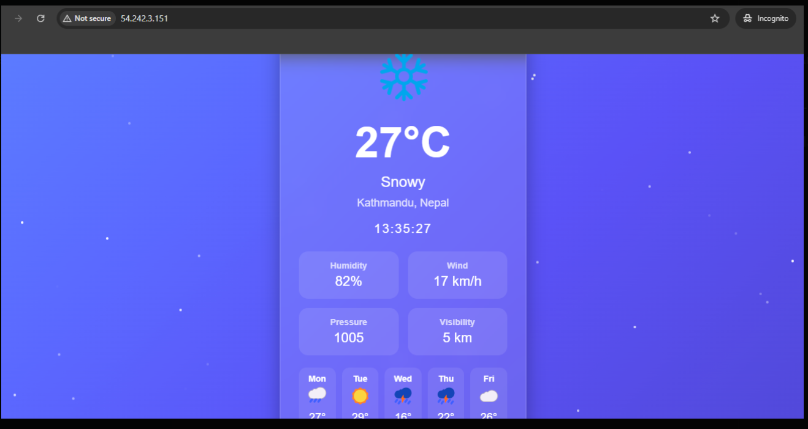

## Lab-01:

## Title:Hosting a Web Server on the Cloud

## Objectives
1.Access the AWS Console through the sandbox environment
2.Launch an AWS EC2 instance
3.Connect to the EC2 instance and install Nginx
4.Deploy a sample web page
5.Access the hosted web page through a web browser

## Theory/Background
## Lab 01 — Hosting a Web Server on the Cloud

Title: Hosting a Web Server on AWS EC2 with Nginx

Objectives
- Launch an AWS EC2 instance and configure networking/security.
- Connect to the instance using SSH (Windows/macOS/Linux).
- Install and configure Nginx to serve a static website.
- Deploy a sample HTML page and verify access from a browser.
- Perform basic troubleshooting and secure the server.

Prerequisites
- An AWS account or sandbox access with permission to create EC2 instances and security groups.
- A downloaded key pair (`.pem`) for SSH access.
- Basic familiarity with the terminal (SSH) and a web browser.

Background (brief)
Cloud servers like AWS EC2 allow you to run virtual machines on demand. Nginx is a lightweight, high-performance web server often used to serve static sites and act as a reverse proxy.

Materials
- Ubuntu Server AMI (Ubuntu 20.04/22.04 recommended)
- Instance type: `t2.micro` (free tier) or equivalent
- Security group allowing inbound `SSH (22)` and `HTTP (80)`

Procedure

1. Launch an EC2 instance
- In the AWS Console go to EC2 -> Instances -> Launch instances.
- Choose an Ubuntu Server AMI and an instance type (e.g. `t2.micro`).
- Configure an existing or new key pair. Download the `.pem` file (keep it safe).
- Create or select a security group that allows inbound rules for:
  - SSH (TCP 22) from your IP (restrict to your IP for security).
  - HTTP (TCP 80) from anywhere (0.0.0.0/0) if you want public access.
- Launch the instance and note the public IPv4 address.

2. Connect to the instance (SSH)
- On macOS/Linux:
  - Ensure key has correct permissions:
    chmod 400 path/to/key.pem
  - Connect:
    ssh -i path/to/key.pem ubuntu@<PUBLIC_IP>
- On Windows with PowerShell (OpenSSH):
  - Run:
    ssh -i C:\path\to\key.pem ubuntu@<PUBLIC_IP>
- On Windows with PuTTY:
  - Convert the `.pem` to `.ppk` using PuTTYgen, then connect with PuTTY using username `ubuntu`.

3. Install and start Nginx
On the EC2 instance run:
  sudo apt update
  sudo apt install -y nginx
  sudo systemctl start nginx
  sudo systemctl enable nginx

Verify Nginx is running:
  sudo systemctl status nginx
  curl -I localhost

4. Deploy the sample web page
Replace the default index page with a simple HTML file:
  sudo tee /var/www/html/index.html > /dev/null <<'HTML'
<!doctype html>
<html lang="en">
  <head>
    <meta charset="utf-8">
    <meta name="viewport" content="width=device-width,initial-scale=1">
    <title>My Cloud Web Server</title>
  </head>
  <body>
    <h1>Welcome to Nginx on AWS EC2</h1>
    
This page is served from an EC2 instance running Nginx.

  </body>
</html>
HTML

Set correct ownership/permissions if needed:
  sudo chown -R www-data:www-data /var/www/html
  sudo chmod -R 755 /var/www/html

5. Access the site from your browser
- Open `http://<PUBLIC_IP>` in your browser. You should see the sample page.

Verification commands
- From local machine (if `curl` available):
  curl http://<PUBLIC_IP>
- From the instance:
  curl http://localhost

Security notes
- Restrict SSH (`22`) to only the IPs that need access (avoid 0.0.0.0/0).
- Consider using `ufw` to allow only required ports:
  sudo apt install -y ufw
  sudo ufw allow OpenSSH
  sudo ufw allow 'Nginx Full'
  sudo ufw enable

Troubleshooting
- Page not loading:
  - Verify security group inbound rules include `HTTP (80)`.
  - Check `nginx` status: `sudo systemctl status nginx`.
  - Check `/var/log/nginx/error.log` for errors.
- SSH connection refused:
  - Ensure the instance is running and the public IP is correct.
  - Ensure the `.pem` file permissions are set (`chmod 400 key.pem`).
  - Confirm security group allows SSH from your client IP.

Expected Output
- `nginx` service is active and enabled.
- `curl http://<PUBLIC_IP>` returns the HTML page content.

Assessment / Questions
- What are three advantages of using Nginx for IoT dashboards?
- How would you secure this server for production use?

Screenshots
 - See the screenshot in this folder: screenshot.png.

- Preview:

  

Conclusion
This lab demonstrates launching an EC2 instance, installing Nginx, and serving a static website. It reinforces cloud fundamentals such as instance provisioning, SSH access, security groups, and basic server management.
<!-- image served in the preview above -->